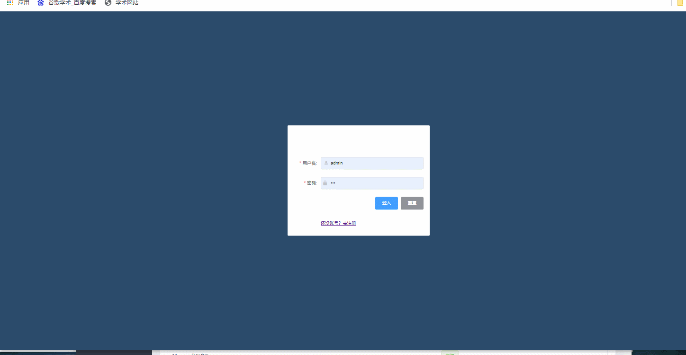

#项目介绍
本项目是基于ssm框架实现的前后端分离的项目，前端实现技术为vue，该项目则是其对应的后台接口的实现。<br>
运行效果展示：     <br>
相对应博客:   <br>
前端程序:   <br>
#使用技术
*   spring+springmvc+mybatis
*   mysql
*   maven
#运行环境
*   apache-maven-3.6.1
*   jdk1.8
*   Tomcat 8.5.491
*   mysql 8.0.15
*   依赖
```java
 <dependencies>
        
        <dependency>
            <groupId>org.projectlombok</groupId>
            <artifactId>lombok</artifactId>
            <version>1.18.18</version>
        </dependency>
        <dependency>
            <groupId>org.springframework</groupId>
            <artifactId>spring-core</artifactId>
            <version>5.2.10.RELEASE</version>
        </dependency>
        <dependency>
            <groupId>junit</groupId>
            <artifactId>junit</artifactId>
            <version>4.13</version>
        </dependency>
        <dependency>
            <groupId>mysql</groupId>
            <artifactId>mysql-connector-java</artifactId>
            <version>8.0.15</version>
        </dependency>
        <dependency>
            <groupId>com.mchange</groupId>
            <artifactId>c3p0</artifactId>
            <version>0.9.5.2</version>
        </dependency>
        <dependency>
            <groupId>javax.servlet</groupId>
            <artifactId>servlet-api</artifactId>
            <version>2.5</version>
        </dependency>
        <dependency>
            <groupId>javax.servlet.jsp</groupId>
            <artifactId>jsp-api</artifactId>
            <version>2.2</version>
        </dependency>
        <dependency>
            <groupId>javax.servlet</groupId>
            <artifactId>servlet-api</artifactId>
            <version>2.5</version>
        </dependency>
        <dependency>
            <groupId>org.mybatis</groupId>
            <artifactId>mybatis-spring</artifactId>
            <version>2.0.2</version>
        </dependency>
        <dependency>
            <groupId>org.mybatis</groupId>
            <artifactId>mybatis</artifactId>
            <version>3.5.4</version>
        </dependency>
        <!-- https://mvnrepository.com/artifact/com.fasterxml.jackson.core/jackson-core -->
        <dependency>
            <groupId>com.fasterxml.jackson.core</groupId>
            <artifactId>jackson-databind</artifactId>
            <version>2.9.8</version>
        </dependency>
        <dependency>
            <groupId>org.springframework</groupId>
            <artifactId>spring-beans</artifactId>
            <version>5.2.10.RELEASE</version>
        </dependency>
        <dependency>
            <groupId>org.springframework</groupId>
            <artifactId>spring-jdbc</artifactId>
            <version>5.2.0.RELEASE</version>
        </dependency>
        <dependency>
            <groupId>org.springframework</groupId>
            <artifactId>spring-webmvc</artifactId>
            <version>5.2.10.RELEASE</version>
        </dependency>
        <dependency>
            <groupId>junit</groupId>
            <artifactId>junit</artifactId>
            <version>4.13</version>
            <scope>test</scope>
        </dependency>
        <dependency>
            <groupId>org.springframework</groupId>
            <artifactId>spring-webmvc</artifactId>
            <version>5.2.10.RELEASE</version>
        </dependency>
        <dependency>
            <groupId>javax.servlet</groupId>
            <artifactId>servlet-api</artifactId>
            <version>2.5</version>
        </dependency>
        <dependency>
            <groupId>javax.servlet.jsp</groupId>
            <artifactId>jsp-api</artifactId>
            <version>2.2</version>
        </dependency>
        <dependency>
            <groupId>javax.servlet</groupId>
            <artifactId>jstl</artifactId>
            <version>1.2</version>
        </dependency>
    </dependencies>
```

#目录结构
```java
│  pom.xml
        │  README.md
        │  ssm.sql
        │  ssm1.iml
        │
        ├─.idea
        │      .gitignore
        │      .name
        │      misc.xml
        │      workspace.xml
        │
        ├─preview
        ├─src
        │  ├─main
        │  │  ├─java
        │  │  │  └─com
        │  │  │      └─bupt
        │  │  │          ├─controller
        │  │  │          │      LoginController.java
        │  │  │          │
        │  │  │          ├─dao
        │  │  │          │      LoginMapper.java
        │  │  │          │      LoginMapper.xml
        │  │  │          │
        │  │  │          ├─pojo
        │  │  │          │      Book.java
        │  │  │          │      Pagination.java
        │  │  │          │      User.java
        │  │  │          │
        │  │  │          └─service
        │  │  │                  LoginService.java
        │  │  │                  LoginServiceImpl.java
        │  │  │
        │  │  └─resources
        │  │          applicationContext.xml
        │  │          db1.properties
        │  │          mybatis-config.xml
        │  │          spring-dao.xml
        │  │          spring-mvc.xml
        │  │          spring-service.xml
        │  │
        │  └─test
        │      └─java
        └─web
        │  index.jsp
        │
        └─WEB-INF
        web.xml


```
#功能介绍
*   登入功能
*   注册功能
*   书籍列表展示功能
    *   分页
*   用户列表展示
    *   添加用户
    *   登出
    *   修改用户信息
    *   删除用户
    *   更改用户角色
    *   分页
    *   模糊查询用户
*   权限拦截功能
*   项目展示
<br>

#更新日志
*   version[1]：  初步实现功能并上传
#致谢和总结
感谢b站狂神的ssm教程和黑马的vue前端教程。本项目比较简单，纯个人练手使用，项目存在不规范之处，还请包涵。